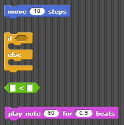
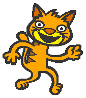
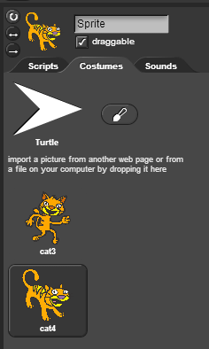

Lab: Welcome to Visual Programming
==================================
Let's open up SNAP at [http://snap.berkeley.edu/run](http://snap.berkeley.edu/run)

You will see a screen like the one shown below. Explore the aspects of the user
interface. Play around for a while and see if you can figure out the major
components of the interface. 

In particular, find the cloud-shaped button on the top toolbar, and use it to create an account on the Snap! server. (You'll have to read your email after creating the account to find your initial password.)

In the next step, you will make your first project
and explore further.

Let’s first look at the IDE (Integrated Development Environment).

Snap! is a programming language -— a notation in which you can tell a computer what you want it to do.  Unlike most programming languages, though, Snap! is a visual language; instead of writing a program using the keyboard, the Snap!  programmer uses the same drag-and-drop interface familiar to computer users.

Start Snap!. You should see the following arrangement of regions in the window:

A Snap! program consists of one or more scripts, each of which is made of blocks. Here’s a typical script:

The five blocks that make up this script have three different colors, corresponding to three of the eight palettes in which blocks can be found. The palette area at the left edge of the window shows one palette at a time, chosen with the eight buttons just above the palette area. In this script, the gold blocks are from the Control palette; the green block is from the Pen palette; and the blue blocks are from the Motion palette. A script is assembled by dragging blocks from a palette into the scripting area in the middle part of the window. Blocks snap together (hence the name Snap! for the language) when you drag a block so that its indentation is near the tab of the one above it:

The white horizontal line is a signal that if you let go of the green block it will snap into the gold one.

If you haven't already done so, make the script in the picture above, then find and click the green flag and see what happens.

Hat Blocks and Command Blocks
------------------
Here's the script from the last screen again:

At the top of the script is a hat block, which indicates when the script should be carried out. [By the way, when you see a word in italics like "hat" above, it often means that a technical term is being defined. You should keep a log of such terms and their meanings. Sometimes a technical term is introduced in a picture, such as the word "palette" that you should already have seen.] Hat block names typically start with the word “when”; in this example, the script should be run when the green flag near the right end of the Snap! tool bar is clicked. (The Snap! tool bar is part of the Snap! window, not the same as the browser’s or operating system’s menu bar.) A script isn’t required to have a hat block, but if not, then the script will be run only if the user clicks on the script itself. A script can’t have more than one hat block, and the hat block can be used only at the top of the script; its distinctive shape is meant to remind you of that.

The other blocks in this script are command blocks. Each command block corresponds to an action that Snap! already knows how to carry out. For example, the block "move 10 steps" tells the sprite (the arrowhead shape on the stage at the right end of the window) to move ten steps (a step is a very small unit of distance) in the direction in which the arrowhead is pointing. We’ll see shortly that there can be more than one sprite, and that each sprite has its own scripts. Also, a sprite doesn’t have to look like an arrowhead, but can have any picture as a costume. The shape of the move block is meant to remind you of a Lego™ brick; a script is a stack of blocks. (The word “block” denotes both the graphical shape on the screen and the procedure, the action, that the block carries out.)

The number 10 in the move block above is called an input to the block. By clicking on the white oval, you can type any number in place of the 10. The sample script above uses 100 as the input value. We’ll see later that inputs can have non-oval shapes that accept values other than numbers. We’ll also see that you can compute input values, instead of typing a particular value into the oval. A block can have more than one input slot. For example, the glide block located about halfway down the Motion palette has three inputs. Most command blocks have that brick shape, but some, like the repeat block in the sample script, are C-shaped. Most C-shaped blocks are found in the Control palette. The slot inside the C shape is a special kind of input slot that accepts a script as the input. In the sample script, the repeat block has two inputs: the number 4 and the script "move 100 steps, turn 90 degrees" .

Make a sprite sing
------------------
For your first project, make a quick song! You will find the following **blocks**
in the Sound tab useful; feel free to change the default numbers as you see fit.

While you are working on it, try to figure out how to connect and disconnect
blocks, and how to remove a piece from inside a long script. Also, what do you
think is the difference between these two blocks?

*Hint*: Try to use many copies of one of the blocks in a row, and hear the
result. Do this for each block.

Meowing: One at a Time or in Unison?
------------------------------------
With this brief introduction to the scratch interface, we begin to examine how
sprites and blocks interact and affect one another. For example, the "play sound"
blocks from earlier allow us to control when and how many sounds we here. Consider
the difference between these two blocks?

If you set up a small script like this, how many meows do you you hear?

How about one like this: How many meows do you hear now?

Experiment with these blocks: 1) How about two "play sound (meow)" and then one
"play sound (meow) until done"?

2) How about two "play sound (meow) until done" and then one "play sound (meow)"

Explain the difference between 1) and 2). Why did you hear a different amount of meows?

Some Starting Lingo
-------------------

| Term | Example/Description |
| ---- | ------------------- |
| Tabs (for blocks) |  |
| Tabs (for sprite) |  |
| Blocks |  |
| Script |  |
| Sprite |  |
| Costumes (Each sprite can have multiple costumes) |  |
| Stage |  |
| Bug  | A defect (or a problem) in the code or routine of a program. |
| User Interface | The place where interaction between humans and machines occurs. For exam, Windows, Scratch, the iPod touch screen, and even your keyboard are examples of user interaces. |

Experiment with a Short Play
----------------------------
Try to make these scripts in SNAP! You will find that the Cat and the Duck have
completely separate script areas. Click on each character to see their script area.
Once you are done, press the green flag to start the short play.

Cat’s Script Window

Duck’s Script Window

A note about style
------------------
You will notice that we chose to name the messages that were broadcast so that
it would help us keep track of what we were doing and what messages we were sending.
We recommend that you do this in your projects!

Hints
-----
To choose a new sprite, drag an image file into the Costume area. Click on the
paint brush to create a new image of your own.

Try to figure out what the commands (whose images are on the left) and buttons
(whose images are on the right) do. These will be helpful to get the characters
to face each other.

Try It! Play
------------
Once you have this working, change the sprites, and then change the script of
the "play" so that each character says at least two additional lines.

Exporting Sprites
-----------------
By this point, you have probably figured out how to save your projects, but you
can also save individual Sprites separately. To save (or export) a Sprite,
right-click on the sprite and select export this sprite. To load (or import) a
Sprite, click on the icon with a folder next to New Sprite (circled in yellow in
the image below) and select the Sprite that you want to add to your project.

