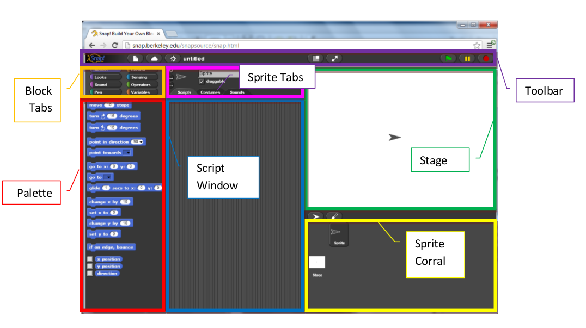

Lab: Welcome to Visual Programming
==================================

Let's open up SNAP at [http://snap.berkeley.edu/run](http://snap.berkeley.edu/run)

You will see a screen like the one shown below. Explore the aspects of the user interface. Play around for a while and see if you can figure out the major components of the interface. In the next step, you will make your first project and explore further.

Let’s first look at the IDE (Integrated Development Environment).

Make a sprite sing
------------------
For your first project, make a quick song! You will find the following **blocks** in the Sound tab useful; feel free to change the default numbers as you see fit.

While you are working on it, try to figure out how to connect and disconnect blocks, and how to remove a piece from inside a long script. Also, what do you think is the difference between these two blocks?

*Hint*: Try to use many copies of one of the blocks in a row, and hear the result. Do this for each block.

Meowing: One at a Time or in Unison?
------------------------------------

With this brief introduction to the scratch interface, we begin to examine how sprites and blocks
interact and affect one another. For example, the "play sound" blocks from earlier allow us to control
when and how many sounds we here. Consider the difference between these two blocks?

If you set up a small script like this, how many meows do you you hear?

How about one like this: How many meows do you hear now?

Experiment with these blocks: 1) How about two "play sound (meow)" and then one "play sound (meow) until done"?

2) How about two "play sound (meow) until done" and then one "play sound (meow)"

Explain the difference between 1) and 2). Why did you hear a different amount of meows?

Some Starting Lingo
-------------------

| Term | Example/Description |
| ---- | ------------------- |
| Tabs (for blocks) |  |
| Tabs (for sprite) |  |
| Blocks |  |
| Script |  |
| Sprite |  |
| Costumes (Each sprite can have multiple costumes) |  |
| Stage |  |
| Bug  | A defect (or a problem) in the code or routine of a program. |
| User Interface | The place where interaction between humans and machines occurs. For exam, Windows, Scratch, the iPod touch screen, and even your keyboard are examples of user interaces. |

