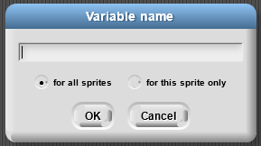
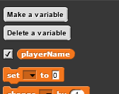
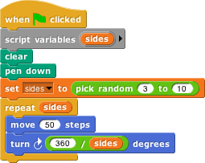
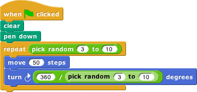
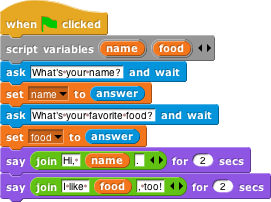
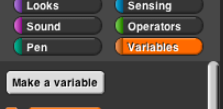
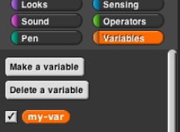

Lab: Variables
==========================
Let's open up SNAP at [http://snap.berkeley.edu/run](http://snap.berkeley.edu/run)


Variables
---------
Variables are named spaces in memory that your program can access. You can set
and modify the values that are contained in these named spaces. To visualize a
variable’s name space think of mail slots in a large mail room. Your computer has
memory that the program is going to use to create and store information. When you
create a variable, you are assigning one of the "slots" of memory to a name and
then can put a value in that slot and modify it as needed.


Why create variables? Variables allow the programmer to make the value modifiable
in the script. For example, you want to be able to update a score variable as the
player wins/loses in a game. You will see many different uses of variables during
this course.

You have multiple blocks to create and manipulate variables in the Variables tab palette.


 * ```Make a variable``` button allows you to create a new variable
 * ```Delete a variable``` button will allow you to delete a button – this
   button only shows after you have created a variable.
 * ```Set [] to (0)``` will allow you to initialize, or set a beginning value,
   the variable to a value.
 * ```Change [] by (1)``` allows you to modify the value of a variable
 * ```Show variable []``` will show the variable and value on the stage.
 * ```hide variable []``` will hide the variable and value on the stage.
 * ```Script variables (a)``` will allow you to create local variables, more on
   this use later

### To create a variable

 * In the box that pops up - type the name of the variable. The default selection
   "for all sprites" means that all sprites have access to this variable. Select
   "for this sprite only" if you want only the sprite currently selected to be
   able to access/modify the value of the variable.



 * Now you'll have blocks to use for your variable.
 * Note that you now have a rounded button with the name of the variable in the
   window with a checkbox to the left. If checked, the variable and value will
   be show on the stage. Uncheck to hide.
 * When you use one of the variable blocks you will be able to click on the combo
   box arrow for a list of your variables.



### Common Bug: Set vs. Change

A very common mistake is to use a change block when you need a set block or use
a set block when you need a change block.

It is actually a little more complicated, in that you can make your set block act
like a change block.


Script Variables
-----------

Sometimes you need a variable in your script, but you don’t want it to step through consecutive integer values as in the for block. A more general way to handle variables uses the block


to create a variable, and the block


to give that variable a value. Both of these blocks are in the Variables palette. Here’s an example:



The script variables block creates a variable called sides (click on the orange "a" to change the name) that can be used throughout this script. (Each time you click the green flag, a new variable is created, and it exists only during that time through the script.) The set block says what value the variable should have. In this case, Snap! will pick a random integer value between 3 and 10 (inclusive). (The pick random block is in the Operators palette; note that we changed the first input from 1 to 3.) The script will draw a regular polygon with that number of sides. The value of sides is used twice, first in the repeat block to say how many times the move-and-turn combination should be done, and again in computing the angle through which to turn for each side.

Try running the script (by clicking the green flag) several times to see what shapes it draws.

We needed the script variable in this script because the randomly chosen number is used twice. If it had been used only once, we could have put the pick random block directly in the script, like this:


Self-test question: Try to explain before you run the script below what could go wrong if we just put the pick random block in the script twice:



Another place where script variables can be useful is in a program that interacts with the user.



This script uses several blocks we haven’t used before. The ask and wait command and the answer reporter are in the Sensing palette. Join is in Operators. If you run the script you should be able to figure out what they do.

Note that this script has two script variables. The script variables block has a little right-facing arrowhead at the end:


If you click the arrowhead, a second orange variable oval will appear. Also, there will be left- and right-facing arrowheads. You can click these to adjust the number of variables you need.

The join block also has arrowheads to control the number of input slots it has. In the text string inputs, both in join and in the ask blocks, the pale brown raised dots represent spaces. The brown dots don’t appear in the text on the stage when the script is run. They’re in the input slots so that you can easily see if there are multiple spaces in a row:


and also so that you can distinguish between a completely empty input slot and one that has a space in it:


Test yourself: Actually, that conversation script could have been made using just one variable. Which one, and how would you do it?


Global Variables
---------------
Sometimes it's not good enough to remember a value inside one script. Instead, you need the value available everywhere in your project. The classic example is the score in a video game; even when no script is running, the score should be remembered.

There was a time, in the early history of programming languages, when all variables were global. This led to a lot of bugs, because different parts of the program would use the same name for different purposes and erase each others' saved values. So don't use global variables as your first choice; think whether a script variable or a for block (which makes a variable local to just that block) would work instead.

To make a global variable, you must go to the Variables palette and click on the Make a variable button (not a block -- you can't put it into a script!):



You will be prompted to give your variable a name. After you do that, you'll see an orange variable oval in the Variables palette:



This can be dragged into scripts just like the orange variable ovals in the for block and the script variables block.

The checkbox to the left of the variable block determines whether or not the value of the variable is displayed on the stage. The variable watcher (which is what that display is called) can be useful for debugging, or can be displayed permanently so that the user of your project can see the score, or whatever you have in the variable. By right-clicking on the watcher, you can change the format in which it appears on the screen.

Try this: Experiment with using a slider watcher to change the value of a numeric variable.

When you make a global variable, you also get a "Delete a variable" button that can be used for the obvious purpose.


