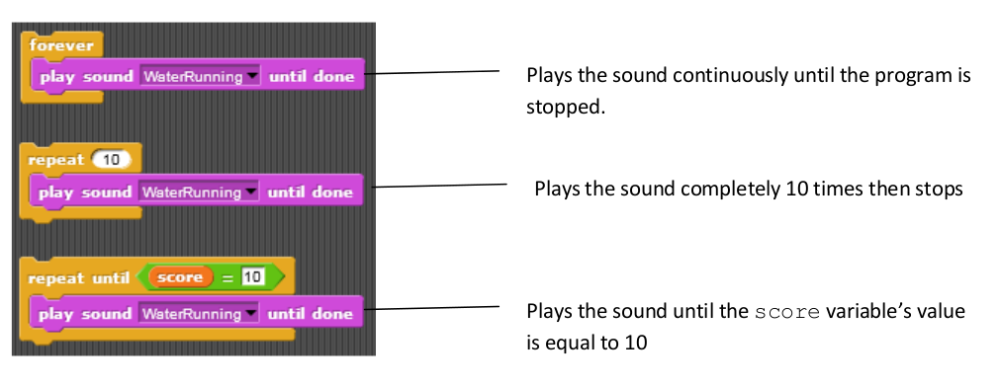
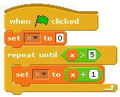
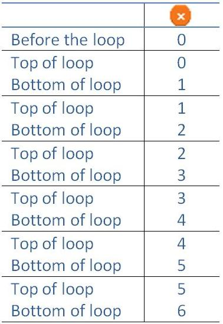
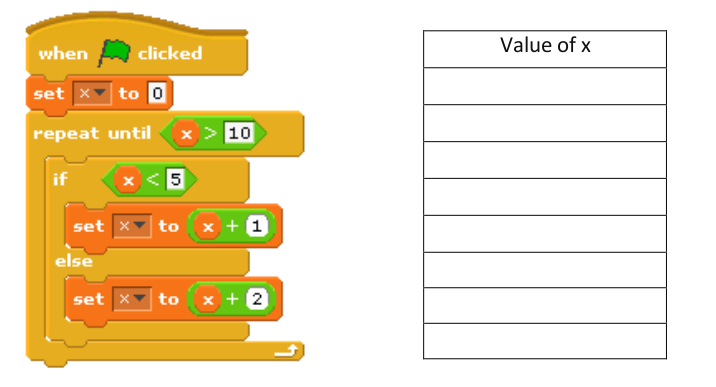
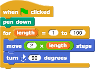
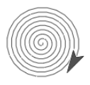

Looping
==========================

Looping Blocks
--------------
There are times when you will want blocks to repeat. Instead of duplicating blocks
and ending up with a long script that might be confusing, there are looping control
blocks that you can wrap around the script you want to repeat.

 * ```forever``` Loops until the program ends. This is basically an *infinite loop*
   as it goes on forever.
 * ```repeat ()``` Loops the specified number of times.
 * ```repeat until &lt; &gt;``` Repeat until the condition is *True*.
 
For the ```repeat until &lt; &gt;``` you will use a predicate block that returns
true or false. These blocks have pointed ends and can be found in the Operators
palette.


Other helpful blocks include the operator blocks.


Operators
---------
Click the Operators tab to display a new palette of blocks. You can use
these blocks to perform mathematic operations to modify a numeric variable.

You have blocks to add, subtract, multiple and divide. You also have a
mod block that does remainder division as well as a round block and a
square root block.

NOTE: To see what any block does, right click on a block in the palette
and select help. A new window will open that will explain what that block does.


Looping Examples
----------------


### Repeat Until
Let’s look at the "repeat until" block a bit closer. Just like REPEAT, it will do everything inside the C-
shaped block a certain number of times. However before it starts the loop each time, it checks to see if
the condition (x > 5) is true. When this is condition is true, it will not repeat again.



It can be really helpful to keep track of what the variable X is at each point to help us understand how
this new piece works.

 * In the right column we keep track of the value of x.
 * In the diagram below we draw a horizontal line every time we start the loop.
   Here we labeled each line "Top of loop" and "Bottom of loop" but we could just
   use the horizontal line to keep track of this information.
 * Within each loop the variable x increases by 1, so we write down the new value for x.



Try to use a chart like the one above to keep track of what happens in the complicated "repeat until"
code below.



The For Block
----------
The repeat block is great if you want to repeat exactly the same behavior each time. Sometimes, though, 
you want to do almost the same thing every time, but with a slight variation. Many such situations can be 
handled by the for block near the bottom of the Control palette:


What's new here is the orange oval with "i" in it. This is called a variable. It represents a different value in each repetition. Try this:


Note that we changed the numbers in the two white-oval input slots. We also dragged the variable i from the for block itself into the say block within its action slot. This "for loop" is equivalent to the following script:


Just saying the variable isn't all that interesting, although we can use that technique to simulate a rocket launch:

[!for](blastoff.png)

But now try this:



Note that we changed the name of the variable, by clicking on the orange oval without dragging it. This shape is called a "squiral" — a square spiral. Do you see why it spirals outward? The length of the move varies between repetitions. If we wanted to create this shape without using for, the script would look like this:

![unroll squiral](unroll-squiral.png]

By the way, try changing the turning angle from 90 to 92. It makes a beautiful picture! Then play around with the numbers and see how close you can come to a smooth spiral:


