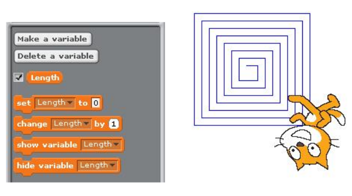

Drawing Tools
========================

Drawing Tools
-------------
There are multiple blocks that can be used to draw. By combining blocks from the Pen palette with
blocks from the Motion palette, you can draw pictures. Your sprite needs to face in the direction you
want the line to be drawn so you will need the point in direction () block.


Try it! Drawing shapes
----------------------
Look at the following scripts to draw a square. The first script has repetitive
code. In the second script, the repeating code has been replaced by using a loop.

Note: By using the ```pen down``` block your sprite will draw for you.


Exercise: Draw a Squaril
------------------------
Make a new variable Length with a looping structure to draw the "Squiral" (Square + Spiral) below. Note
that the length the sprite moves is updating by a constant amount.




Exercise: Freeform drawing
--------------
Create something (anything!) beautiful with the drawing tools. For instance, we
made the following image: 


The image above plays around with pen color and pen size. If you want to create
more complex images, you probably want to use broadcasts to delegate the drawing
of different parts of the image. For example, we used the following broadcasts
for the image above:


*Tip*: Your images will draw more quickly if you use 
to hide the character.

**This is a project grade - You should use all of the skills you have learned.**
 * Broadcasts
 * Looping
 * Variables (if appropriate)
 * Drawing


