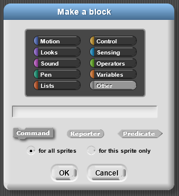
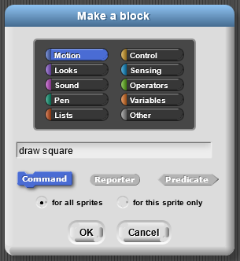
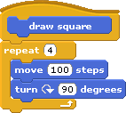
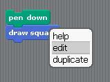
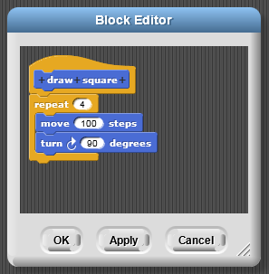
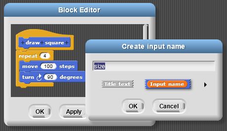

Lab: Build Your Own Blocks
==========================
Let's open up SNAP at [http://snap.berkeley.edu/run](http://snap.berkeley.edu/run)

As you have seen, SNAP/BYOB is a powerful language that has a substantial
repository of useful blocks for a variety of purposes. However, as you may have
noticed, SNAP/BYOB does not have all the blocks that you may need, and often, it
would prove useful if we could create new blocks.


Make Your Own Block: A Tutorial
-------------------------------
We are going to teach the computer how to draw a square using a block named
```draw square```. Please follow the steps below:

 * Click on make a block at the bottom of the variables tab.
 


 * This will open up the ```make a block``` dialog box. Now, you get to choose
   which tab the block should go into. Our block is going to draw a square, so
   let us choose ```Motion```.
 


 * When we selected ```Motion```, the block became blue. We now have the option of
   making blocks of different shapes. Right now, however, we are just going to
   make a (regular) command block.



 * When we click ```OK```, we should see the block editor below.


 * Use the blocks from the regular menus to create a script that draws a square,
   as shown below.



 * When you click ```OK```, you should be able to use this block as if it were a
   regular block. Since you created the block as a ```Motion``` block, it will
   end up at the bottom of the ```Motion``` tab.


Congratulations! You have just created your own block!


Improving the draw square block
-------------------------------
You have created a block that draws a square, but it only draws a square where
each side is of length ```100``` steps. It would be great if we could specify
how long we wanted each side to be. We will edit the block to accept an *argument*
(or *input*), which tells it the length of the square it has to draw.

 * We are going to go back and edit the block. Right-click on the new block and
   select edit to go back to the block editor.



 * In the ```Block Editor```, notice that when you move the mouse over the top
   row of the new block, some plus signs (+) show up. When you click on these
   plus signs, you can add more text or arguments. When you click on the text
   between the plus signs, you can delete or modify that text. Click on the plus
   sign at the far right as shown below:



 * When you click on the plus sign on the far right, you should get the following
   dialog box. With this dialog box, we can select if we want to add input (orange)
   or more text (blue). We want to add the input ```size```, so we type ```size```,
   select ```Input Name``` and click ```OK```.



 * Now, we have a variable inside our block definition.


 * Drag the variable ```size``` down into the move block. Whenever we need a
   new copy of a variable, we just grab the copy from that variable in the top row.


 * When we click OK, we wll see that our draw square block now takes an argument.
   We can put different numbers in the blank and draw squares of different sizes!


Make a draw shape Block
-----------------------
Now, you are going to make a block that takes two inputs. We want to create a
```draw shape``` block that takes a number of sides and a number of pixels for
the length of each side. We will call these input arguments ```n``` and
```pixel```. This exercise should be done with a partner, so introduce yourself
to your neighbor and get started on the exercise together!

By the way, you can create the inputs to this block in exactly the same way as
we did in the previous section, by clicking on the plus signs to add input;
however, you can also type the names of the input as shown below.


The percent signs (%) indicate that the word should be an input. We want you to
feel comfortable with both entry methods.


