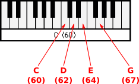

Project- Electronic Keyboard
===================

Here is what you have to do: Create a Snap script that plays a song. That’s it!

There is only one requirement: Your song can’t be too short. It should play a minimum of 25 notes, 
and last at least 15 seconds. If you don’t have any experience with music, below is enough information 
for you to write a script to play Mary Has a Little Lamb, which satisfies these minimal requirements - 
but hopefully you can do more than that!

The main purpose of this assignment is to have you investigate on your own and experiment with an area of Snap 
that we have not looked at: sound. If you do this in a school lab, you should use headphones so that you can 
hear the sound generated by your scripts without disturbing others in the lab. Everything you need is located 
in the “Sound” category of the blocks palette, so experiment with the various blocks to see what they do.

If you do just the minimum, you can expect at most a mid-B for a grade. To do better than that you must experiment 
and try different instruments and different effects. Maybe a drum riff? (Isn’t it obvious that the way to spice up 
“Mary Has a Little Lamb” is to add a drum solo?) You should also look for sensible places to replace common sequences 
with custom blocks - most songs have some repetition in them, so this shouldn’t be hard to do.

A Brief Music Lesson
------

You only have to know a little bit about music to complete this assignment. When you use the “play note” block, 
the first parameter is the note that should be played, represented as a number.  This number is a scale of 
half-steps, but when you click on the number to change the note you get a picture of a keyboard. The following 
picture shows four notes labeled with their names (C, D, E, and G) and the corresponding number values.

These four notes are all the notes used in the song “Mary Had a Little Lamb” - you can make that song by 
playing the following notes: E, D, C, D, E, E, E, (pause), D, D, D, (pause), E, G, G, (pause), E, D, C, D, 
E, E, E, E, D, D, E, D, C.
