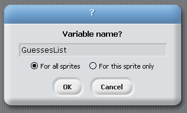
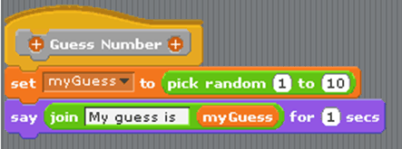
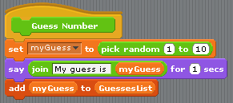
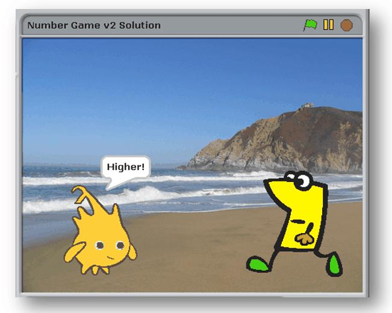

Lab: Guessing Game version 2.0
==============================
The Number Guessing Game that you created last week had you utilize IF statements and random
number generators. This week, you will expand upon that game and make it smarter! The goal of this
Expanded Guessing Game (we’ll call it, version 2.0) is to make sprites that play the game smarter! In
addition, since this will make the game much faster, we’ll make the guessing sprite have to get three
guesses right to win.

Open your Guessing Game project from the last unit to use as a reference. Create a new project called
yourLastName_GuessingGame2. This version will use two sprites: one to hold the secret number and
give hints and the other to try to guess the secret.


Step 0
------
Before beginning to build your program, let’s look at what variables we will need and what each sprite
should do to play the game.

Variables:
 * The guess from the guesser sprite
 * List to hold the guesses
 * The number of times the guesser sprite has guessed
 * The secret number
 * The number of times the guessing sprite wins

Tasks:
 * The First Sprite (the guide) needs to initialize the variables by setting them to 0 and picking
   a secret number.
 * The First Sprite asks the second Sprite to guess.
 * The Second Sprite (the guesser) guesses a number.
 * The Second Sprite adds its guess to a list.
 * The First Sprite gives a hint based on the guess.
 * Repeat the second through fifth step until the guess is correct.
 * Repeat the program until the second sprite wins three times.


Step 1
------
You will need to set up your ‘Game Guide’ sprite (or sprite 1) that will be asking for the guess just as it
did in your last lab. Review the task list above if needed. The sprite will need to first set up all variables
(don’t forget to initialize) then repeatedly ask for a guess checking to see it the secret number is guessed
or if a hint should be displayed. When the secret number is guessed, you want to stop and tell the
number of guesses it took to win that game (and maybe say “Congrats” or another message).
Go ahead and set up this part of your script. Don’t forget you will need to ‘ask’ the guessing sprite for its
guess. What is a good way to do this? How have you communicated with another sprite earlier?


Step 2
------
Let’s create a Give Hint procedure and move the blocks that handle this task into the blocks editor. Now
just add the Give Hint procedure into your sprite 1’s script where it should be.


Step 3
------
Now let’s work with the guessing sprite to add a list of the guesses. Remember a list is a collection that
can contain multiple values of information. Think of a list as a container for multiple values. You can add,
search for, and remove information from a list. Lists are very powerful data structures, and have many
uses in Computer Science! For our lab, we’ll make a simple list to store the guesses that our sprite has
made so far.

To create a list, click “Make a Variable” in the Variables Tab.

 

Call your list variable whatever you like. The name should be something descriptive and informative
though. In the example above, we named the list “GuessesList”.

Now we are going to tell BYOB/SNAP that the variable is a list. Notice that when you click on the set
command, you will see the variable show a list as its contents (it will not be a list until you click on the
set command).


Step 4
------
Let’s make a procedure called Guess Number for the guessing sprite to guess the number. To do that
select the guessing sprite and click Make a Block in the Variables palette. Let’s look at the algorithm for
this new block. We want the sprite to guess a number between 1 and 10 (inclusive) and say the number.

Will you need a variable to hold the guess?

### Algorithm (Pseudocode)

    To Guess Number:
      Set the guess to a random number between 1 and 10, inclusive
      Say the guess.

### Code Script in Blocks Editor



Add the code into the Block Editor. Click the block in the sprite’s window to make certain it works as
expected.


Step 5
------
Now let’s expand this procedure so that it will keep track of the guesses this sprite has already guessed
so that the sprite does not guess the same number twice. In order to do this task, we will want to keep a
list of all the guesses (myGuess).

First, drag the ```add (thing) to ()``` block into your block editor. The "add 'thing' to..." block will add
the myGuess value to your list. This is a very useful block that you’ll likely use in the future as well (hint
hint). The "thing" can be replaced by either something you specify, or a variable. In this case, we want to
add the number that we've just guessed to the list. Drag the variable "myGuess" into the Block Editor
and snap it into the 'thing' field. It should look like this now:



So now our block will pick a random number, say it, and add it to a list. This doesn’t quite yet accomplish
what we need. What we want is for the "Guess Number" function to only choose a number as long as it
hasn’t already been guessed. What we need here is a loop with an IF statement! You will need to add
this in Try It! #1.


Try It! Guessing Game v. 2
--------------------------

### Try It #1
Expand the “Guess Number” function in the guessing sprite so that it only says the guess and
adds it to the list as long as the value of myGuess is not already in the list. This block with an IF
block may come in handy.


### Try It #2

Next, let’s expand the script we have in the original sprite (not the guessing sprite). Add an
additional loop around the game so that the “repeat until” loop keeps running until the guessing
sprite has guessed the secret number correctly (or won) 3 times. You may need a wins variable
for this (hint).

Run your game. Make sure the check mark beside your guesses list is checked, and you can see
the list of guesses populate itself on the stage as the guessing sprite adds guesses to its list!
Notice that as guesses fills up, it takes the guessing sprite a bit longer to guess. This is because
the guessing sprite is making sure that he does not guess a number he’s already guessed! Unless
your guessing sprite is very lucky, once guesses fills up, the guessing sprite will freeze and stop
guessing. Why is this?

Fix the game so that the guessing sprite doesn’t freeze! The way we have it now, once
the guessing sprite wins, the guesses list is NOT cleared. The sprite should reset the
guess list after winning! In addition, you’ll notice that guesses does not reset when you
restart the game. The list should also be cleared when the game starts. On top of that,
all of the variables should be reset when the game starts!

This block should help: 

### Try It #3

Let’s make the guessing sprite smarter! If you were playing a guessing game with someone and
had guessed 3 and was told it was too low, would you guess 3 or lower? Of course not, you
would guess 4 or above. Instead of guessing between 1 and 10, now you want the guessing
sprite to guess between two values that will vary as guesses are made. If you want values to
vary, maybe we should use variables to determine the low and the high for our guessing sprite
to guess between.

So, give the same logic to the guessing sprite.

### Try It #4

Test your game!



