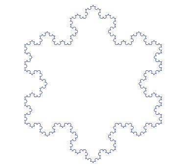
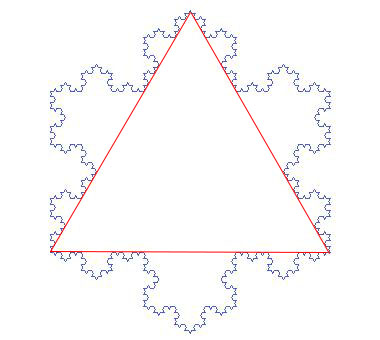
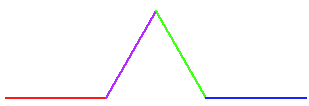
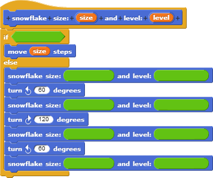

Koch Snowflake
===
Using recursion we can make beautiful things! 
In this step you will learn to make the beautiful Koch snowflake (below). 

The entire snowflake consists of three copies of a fractal, arranged in a triangular shape-

This fractal does not return to the same place between recursive calls. For example, the base case has the sprite start on the left and go to the right (below). 

Then at every successive level, it repeats the previous level 4 times in a pattern shown below. Look at the images 
below to see how the previous level is repeated in each higher level. 

Something that is hard to tell visually is that each recursive call is one-third the size of the caller. (This makes the entire fractal the same distance from left to right in every level.) Fill in the blanks in the following recursive procedure to draw the Koch snowflake. Note that at the end of each recursive call we do not end where we started as we did with the trees. 

When you get one side of the snowflake working, combine three of these to make the entire snowflake. 
