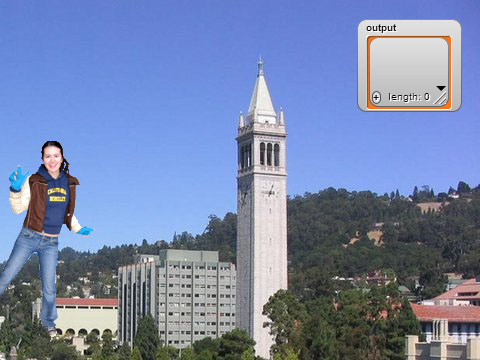

Solving Problems With MapReduce
=========================
To get started, load up our finished Snap! project, [MapReduce](http://snap.berkeley.edu/snapsource/snap.html#open:http://bjc.berkeley.edu/bjc-r/prog/Snap/MapReduceStarter.xml). Your screen should look like this:

Now, click the green flag to get started and initialize the system. After that, you can type any number 1-5 to run one of the five MapReduces below, and 'r' to reset to the initial state. We have given you the answers to 1, so you can see and understand what the problem is asking you to do and what the expected output is. You will construct the mapper and reducer blocks for 2, 3, 4, and 5 in the later exercises of the lab.

By the way, the word Domain means 'input', and the word Range means 'output'.

Your First MapReduce : A Simple Sum-of-Squares
----------
We are going to start by showing you how we do a really easy one, and work up to some hard ones. This problem involves finding the sum of squares of some numbers. E.g., 12 + 202 + 32 + 102 = 510 (nice area code, eh?)
 * Problem - *A sum of squares of numbers*
 * Input - *numbers, each one a different list element*
 * Map Domain - *number*
 * Map Range - *number*
 * Map Function - *square*
 * Binary reducer function - *+*
 * Output- *a single number*
 
...and here is what it looks like when we do it

Let's note a couple things- 
* The mapper should take a single number as input, but what we have used for simplicity is just the  block, which has two inputs. You also recall that Snap!, given a function of two inputs but with only one input (each element in Map's input list in this case) will just copy the input to all the fields, making it a nice, effective square procedure.
* As we go through more detailed examples, we are going to want to write a mapper and reducer funtions as separate and defined blocks, so for good code management, we are going to define one sprite per MapReduce problem, each of which has a mapper () and reducer (), with the answers already filled in. Once you understand what the problem is, first edit the mapper block, delete its body, and see if you can recreate it. Once you have got a working mapper, do the same with the reducer. That way, you will always have a working system. Note that we have written a lot of helper functions to make your life easier. Feel free to use the Scripts area of each sprite for debugging. When you are done with each of these, compare your answer with ours.

Your Second MapReduce - Alpha, the First Word in the Dictionary
----

We are going to start easy and tell you how to write your mapper and reducer. In fact, this problem is so easy, it just requires you to write the reducer, since the mapper is the same as the identity ! (i.e., the mapper just passes its input through, untouched, and the reducer has to do all the work!). Fill in the body for the mapper and reducer for the Alpha sprite and test it.

 * Problem- *The first word in the dictionary in all of Shakespeare's works*
 * Input	- *All of Shakespeare's works, each word a different list element*
 * Map Domain	- *word*
 * Map Range	- *word*
 * Map Function	- *identity*
 * Binary reducer function	- *Take two words and return the earlier word in the dictionary*
 * Output- *a single word*
 

Your Third MapReduce - Love, All the Beatles song titles with the word "love" in it
-----

Hopefully that last one was not too bad. This one is a little harder because you have to write both the mapper and reducer. The idea is that you have a huge set of data and you need to keep only the ones that match. Fill in the body for the mapper and reducer for the Love sprite and test it.

 * Problem - *All the Beatles song titles with the word "love" in it. This is effectively a "filter" operation, removing all the list elements that do not match.*
 * Input	- *All of the Beatles song titles, each song title a different list element*
 * Map Domain	- *Song title (sentence)*
 * Map Range	- *a list of the song title; or an empty list*
 * Map Function	- *Look for the word "love" in the title, if it is there, return title as a one-element list, otherwise return the empty list*
 * Binary reducer function- *Merge all the lists together that the mappers (and other reducers) return into one big list*
 * Output - *Same form as the input: a list of song titles, except each one has the word "love" in it.*

