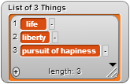
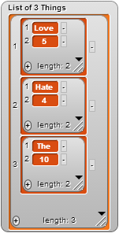

Solving Problems With MapReduce
=========================
To get started, load up our finished Snap! project, [MapReduce](http://snap.berkeley.edu/snapsource/snap.html#open:http://bjc.berkeley.edu/bjc-r/prog/Snap/MapReduceStarter.xml). Your screen should look like this:

Now, click the green flag to get started and initialize the system. After that, you can type any number 1-5 to run one of the five MapReduces below, and 'r' to reset to the initial state. We have given you the answers to 1, so you can see and understand what the problem is asking you to do and what the expected output is. You will construct the mapper and reducer blocks for 2, 3, 4, and 5 in the later exercises of the lab.

By the way, the word Domain means 'input', and the word Range means 'output'.

Your First MapReduce : A Simple Sum-of-Squares
----------
We are going to start by showing you how we do a really easy one, and work up to some hard ones. This problem involves finding the sum of squares of some numbers. E.g., 12 + 202 + 32 + 102 = 510 (nice area code, eh?)
 * Problem - *A sum of squares of numbers*
 * Input - *numbers, each one a different list element*
 * Map Domain - *number*
 * Map Range - *number*
 * Map Function - *square*
 * Binary reducer function - *+*
 * Output- *a single number*
 
...and here is what it looks like when we do it

Let's note a couple things- 
* The mapper should take a single number as input, but what we have used for simplicity is just the  block, which has two inputs. You also recall that Snap!, given a function of two inputs but with only one input (each element in Map's input list in this case) will just copy the input to all the fields, making it a nice, effective square procedure.
* As we go through more detailed examples, we are going to want to write a mapper and reducer funtions as separate and defined blocks, so for good code management, we are going to define one sprite per MapReduce problem, each of which has a mapper () and reducer (), with the answers already filled in. Once you understand what the problem is, first edit the mapper block, delete its body, and see if you can recreate it. Once you have got a working mapper, do the same with the reducer. That way, you will always have a working system. Note that we have written a lot of helper functions to make your life easier. Feel free to use the Scripts area of each sprite for debugging. When you are done with each of these, compare your answer with ours.

Your Second MapReduce - Alpha, the First Word in the Dictionary
----

We are going to start easy and tell you how to write your mapper and reducer. In fact, this problem is so easy, it just requires you to write the reducer, since the mapper is the same as the identity ! (i.e., the mapper just passes its input through, untouched, and the reducer has to do all the work!). Fill in the body for the mapper and reducer for the Alpha sprite and test it.

 * Problem- *The first word in the dictionary in all of Shakespeare's works*
 * Input	- *All of Shakespeare's works, each word a different list element*
 * Map Domain	- *word*
 * Map Range	- *word*
 * Map Function	- *identity*
 * Binary reducer function	- *Take two words and return the earlier word in the dictionary*
 * Output- *a single word*
 

Your Third MapReduce - Love, All the Beatles song titles with the word "love" in it
-----

Hopefully that last one was not too bad. This one is a little harder because you have to write both the mapper and reducer. The idea is that you have a huge set of data and you need to keep only the ones that match. Fill in the body for the mapper and reducer for the Love sprite and test it.

 * Problem - *All the Beatles song titles with the word "love" in it. This is effectively a "filter" operation, removing all the list elements that do not match.*
 * Input	- *All of the Beatles song titles, each song title a different list element*
 * Map Domain	- *Song title (sentence)*
 * Map Range	- *a list of the song title; or an empty list*
 * Map Function	- *Look for the word "love" in the title, if it is there, return title as a one-element list, otherwise return the empty list*
 * Binary reducer function- *Merge all the lists together that the mappers (and other reducers) return into one big list*
 * Output - *Same form as the input: a list of song titles, except each one has the word "love" in it.*

A Quick Aside on Writing Lists on Paper...
-----
This one is a quite a bit harder because of all the list manipulation. The idea is that you have a huge corpus of data and you want to count all the times specific words appear. Fill in the body for the mapper and reducer for the WordCount sprite and test it.

Remember the Midterm handout "Writing Snap! code on Paper"? Well, we are going to add something to it. When you want to write a list of things, write them with an open parenthesis, then the first item, second item, etc. (separated by spaces) and when you are done, put a closed parenthesis. If any of your items are a sentence, you have to put quotes around the sentence. So, for example, the list of three things

...would be written as the equivalent 3-element-list: (life liberty "pursuit of happiness"). Similarly, a nested list just shows up as a nested set of parenthesis. e.g.,

...would be written as ((Love 5)(Hate 4)(The 10)). We mention this because we have used this short-cut below. Now, on to the problem.

 * Problem	- *For every word in Shakespeare's works, the number of times it occurs. e.g., ((Love 123) (Hate 4) (the 25231) etc)*
 * Input - *All of Shakespeare's works, each word a different list element*
 * Map Domain	- *word*
 * Map Range	- *A list of a list of two elements, the word and 1. This is the same as the format of the final mapreduce output if shakespeare would have only written one word. e.g., ((Love 1))*
 * Map Function	- *Make a list of a list of the input word and the number 1*
 * Binary reducer function	- *Take two lists of words and their counts and merge them. E.g., ((Hate 4) (Love 3)) and ((Love 2) (The 10)) merge to ((Love 5) (Hate 4) (The 10))*
 * Output - *a single list of lists, with each inner list a unique word and its count*

Here are some tips on how to get started with WordCount
 * Start with the mapper as always.
 * We have provided the MakeWordCount, GetCount-from-WordCount, and GetWord-from-WordCount helpers. Use them as needed.
 * When writing your reducer, think about the general case of combining two lists as in the example above. Hate is only in the first list. The is only in the second list. Love is in both lists. How do you merge these two lists?
 * We found it useful to write the helper GetCount-of-Word-()-from-List ... feel free to use this when writing reducer, but make sure you could write this on your own too.
 
 
Extra for Experts -the Fifth MapReduce ... Google, building a Google-like index
-------
The idea here is that you have a huge set of webpages (URLs) and webpage-content, and you want to create a huge table indexed by each word that shows you what URL the word is in. Fill in the body for the mapper and reducer for the Google sprite and test it. Hint: This problem is very similar to WordCount.

 * Problem	- *Google simulation! Given web pages (URLs) and data, create a massive reverse-lookup-table, that allows us to quickly query, given any single word, what webpages it was on.*
 * Input	- *The input is a list of lists. The first element in each inner list is the web page address, the second element is the content of the webpage*
 * Map Domain	- *Two-element list, the web page address and the text of the web page*
 * Map Range	- *A list of lists, where the inner list has the word as the first element and all the URLs that have the word as followup elements. e.g., if the input were: ("hamlet" "to be or not to be"), the output would be ((to hamlet) (be hamlet) (or hamlet) (not hamlet))*
 * Map Function	- *For every unique word in the webpage, make a list of the word and the URL. Return a list of all these pairs.*
 * Binary reducer function	- *Take two lists of words and their counts and merge them. E.g., Given ((to hamlet) (be hamlet) (or hamlet) (not hamlet)) and ((to webster) (wit webster)), it would return ((to hamlet webster) (be hamlet) (or hamlet) (not hamlet) (wit webster))*
 * Output - *A single list of lists, with each inner list a unique word as the first element and the URLs that contain the word as the following elements.*
