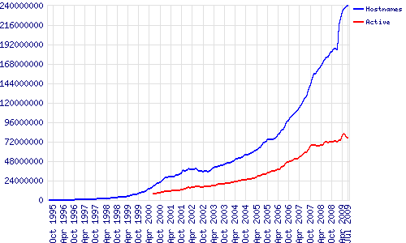

Life Before Search
==================

Now consider a single cluster of technologies: the Internet and web search. These technologies have only been popular for 20 - 30 years, but its hard to imagine life before them.

Before Search Engines and the Internet
--------------------------------------
Before the Internet became the phenomenon that it is today, it was considerably more difficult to share information with others, especially if they weren't in the same area of the world. In addition to you and your classmates' submissions in the discussion forum, [CyberNetNews](http://cybernetnews.com/cybernotes-life-before-the-internet-was-like/) mentions a number of differences between then (15 years ago) and now.

The Internet today provides a tremendous service of making information available to anyone in the world that can connect to it. "Information" can take the form of company websites, email, instant messaging, audio / video, and many, many other possibilities.

Early Search Engines
--------------------
The time of the Internet before search engines was tough as well. The Internet was the same decentralized, wildly diverse collection of information that it is today (although a good bit smaller), but was also terribly difficult to navigate: it was comparable to a telephone network without a phone book. Finding your way to new places on the Internet often involved someone telling you about their site, or stumbling across a site from one you were already familiar with.

Not being ones to shy from problems, computer scientists noticed this shortcoming and began working on technology that would automatically crawl and index (more on these later in [How Google Works]({{ site.baseurl}}curriculum/10-internet/readings/02-how-google-works)) the websites that they could find. The directories they created became early search engines. A number of search engines like Lycos, Dogpile, Altavista and Askjeeves used to be big players in the search market. These search engines made huge steps in organizing the Internet by bringing most of it to one place. Nevertheless, the search process was unrefined by modern standards and often required users to search through long lists of sites to find what they needed.

Alas, this wasn't the case for long. Tremendous progress has been made between then and now, much of which has come from a single company that devoted its entire business to search: Google.

Today's Search
--------------
Almost anyone these days is able to find information from across the world in less than half of a second. You can answer almost any question whose solution is known by humanity in under 30 seconds. The amount of information that is available online has taken the world by storm, shifting entire industries and antiquating others. There are tens of millions of websites online at any one time and more are being added every year.

If there is so much information available on the Internet, it seems pretty remarkable that today's search engines can come up with such startlingly accurate results for what we want, when we want it.

